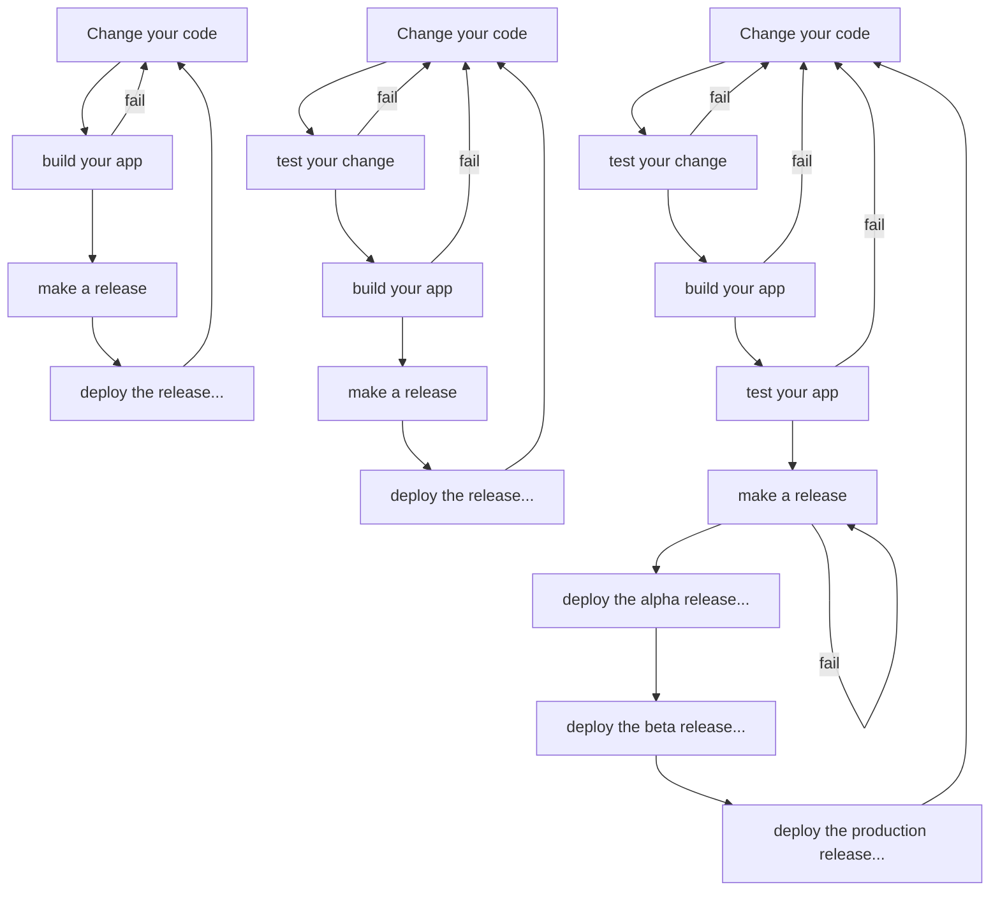
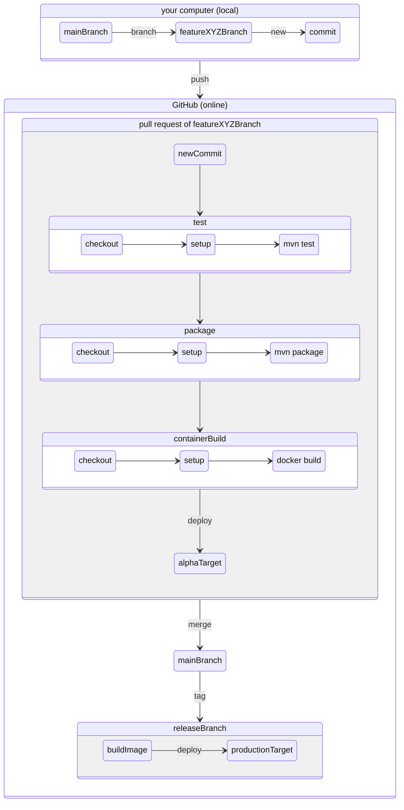
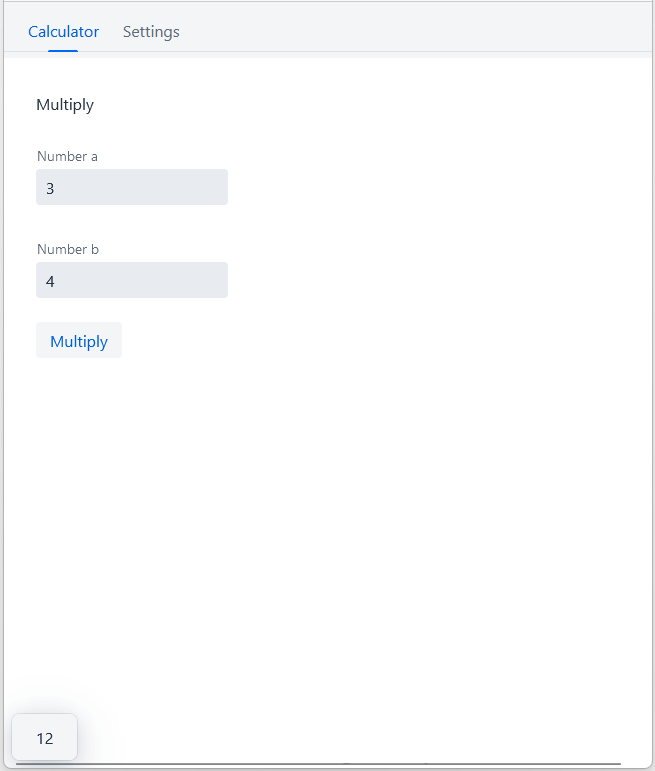

# HSD FBEI: Software Engineering 3, Prof. Dr. Pedram Nazari

## Information
### How to get your software to your customer/consumer

- ...to the (alpha/beta/production) server if it is a server application
- ...to your client distribution platform if it is a client or client-only application
  - android app->play store
  - apple app->app store
  - windows app->windows store
  - ubuntu app->snap store

### Where are those things happening?

## Course

In this course you will participate in a team development of a web app made with [Java](https://openjdk.org/) and the [Vaadin Framework](https://vaadin.com/).

Already provided is...

- a working app skeleton
- CI with [GitHub actions](https://github.com/features/actions)

### Continuous Integration with GitHub Actions

Every commit to the `main` branch will trigger a [GitHub action](https://github.com/features/actions), defined in the [publish.yml](https://github.com/hsd-inflab/se3/blob/main/.github/workflows/publish.yml) workflow file. This action will checkout the source code, install openjdk, test the files in the test directory, create a java archive, create a docker image and deploy it to docker hub:

In every pull request [another GitHub action is triggered](https://github.com/hsd-inflab/se3/blob/main/.github/workflows/CI.yml) which checks out the source code, installs openjdk, tests the files in the test directory and create a java archive.
If every steps succeeds and the pull request is being marked as approved it is merge-able.

### Simplifications

- the deployment happens after merge to main, not with every commit in the pull request
- no alpha, beta targets
- no integration tests
- main == release

### Setup
1) [Install docker](https://www.docker.com/products/docker-desktop/)
2) [Install Java17+](https://adoptium.net/de/)
3) Install [VsCode](https://code.visualstudio.com/)
4) Install VsCode extensions
   1) [Java Extension Pack](https://marketplace.visualstudio.com/items?itemName=vscjava.vscode-java-pack)
   2) [Spring Boot Extension Pack](https://marketplace.visualstudio.com/items?itemName=vmware.vscode-boot-dev-pack)
   3) [Docker](https://marketplace.visualstudio.com/items?itemName=ms-azuretools.vscode-docker)
   4) [GitHub Actions](https://marketplace.visualstudio.com/items?itemName=GitHub.vscode-github-actions)
   5) [GitHub Pull Requests And Issues](https://marketplace.visualstudio.com/items?itemName=GitHub.vscode-pull-request-github)

### TODO
1) Assign yourself to an issue
2) Clone this repository
3) Create a branch locally
4) Change code
5) Provide a test for a new feature
6) Stage your changes
7) Commit your changes
8) Publish your branch
9) Make a pull request
10) Check that all status checks are successful
11) Request review
12) Await merge

### Further steps

- analyze step
- format step
- setup versioning strategy
- use codecov action to compare test/code proportion and report if lower than threshold X
- use GitHub projects to improve the development process (kanban? scrum?) 