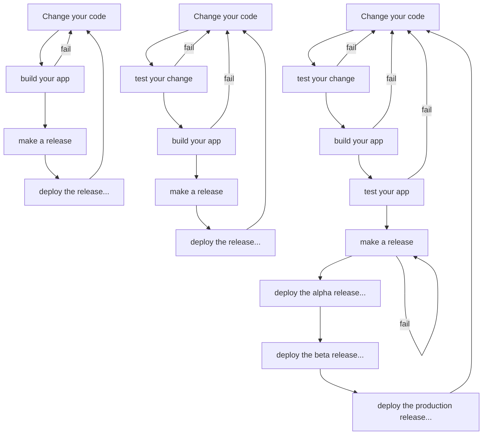
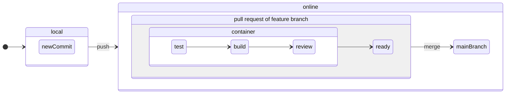
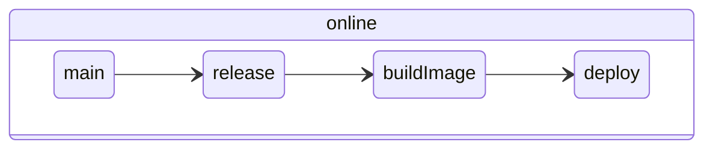

WIP

# Software Engineering 3
## Prof. Dr. Pedram Nazari

## How to get your software to your customer/consumer

- ...to the (alpha/beta/production) server if it is a server application
- ...to your client distribution platform if it is a client or client-only application
  - android app->play store
  - apple app->app store
  - windows app->windows store
  - ubuntu app->snap store

## Where are those stages happening?

