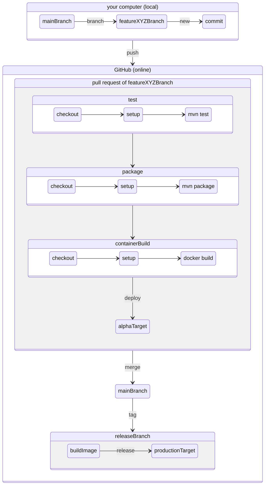

# HSD FBEI: Software Engineering 3, Prof. Dr. Pedram Nazari

## Information
### How to get your software to your customer/consumer

- ...to the (alpha/beta/production) server if it is a server application
- ...to your client distribution platform if it is a client or client-only application
  - android app->play store
  - apple app->app store
  - windows app->windows store
  - ubuntu app->snap store

### Where are those things happening?

## Course

### Simplifications

- no deployment on pull request
- no alpha, beta targets
- no integration tests

### Setup
1) [Install docker](https://www.docker.com/products/docker-desktop/)
2) [Install Java17+](https://adoptium.net/de/)
3) Install [VsCode](https://code.visualstudio.com/)
4) Install VsCode extensions
   1) [Java Extension Pack](https://marketplace.visualstudio.com/items?itemName=vscjava.vscode-java-pack)
   2) [Spring Boot Extension Pack](https://marketplace.visualstudio.com/items?itemName=vmware.vscode-boot-dev-pack)
   3) [Docker](https://marketplace.visualstudio.com/items?itemName=ms-azuretools.vscode-docker)
   4) [GitHub Actions](https://marketplace.visualstudio.com/items?itemName=GitHub.vscode-github-actions)
   5) [GitHub Pull Requests And Issues](https://marketplace.visualstudio.com/items?itemName=GitHub.vscode-pull-request-github)

### TODO
1) Assign yourself to an issue
2) Clone this repository
3) Create a branch locally
4) Change code
5)  Stage your changes
6) Commit your changes
7) Publish your branch
8) Make a pull request
9) Check that all status checks are successful
10) Request review
11) Await merge